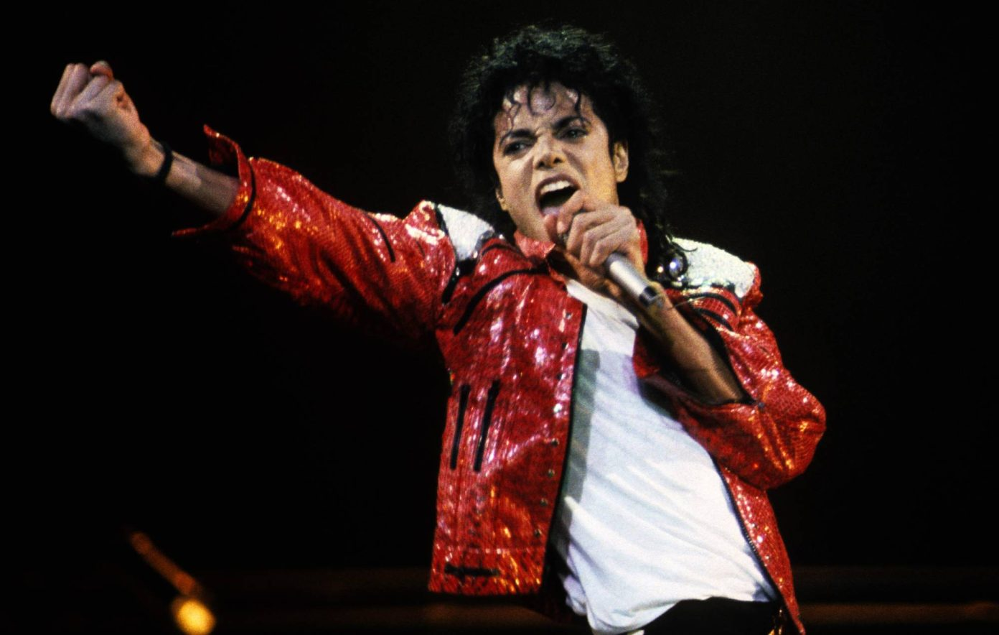
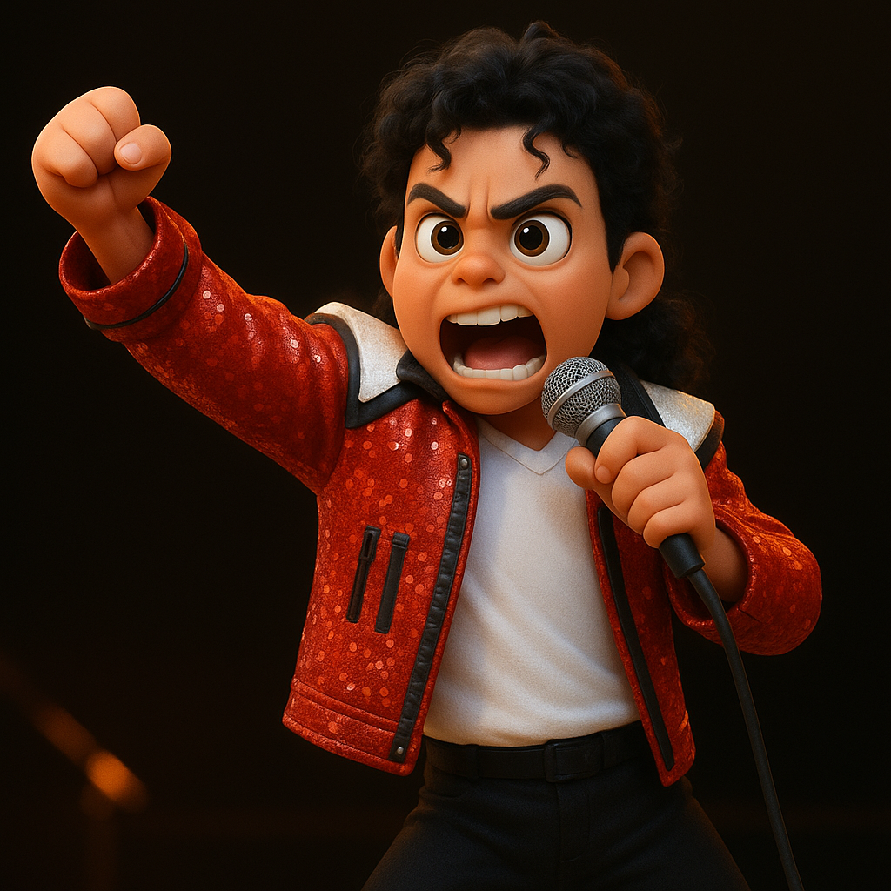
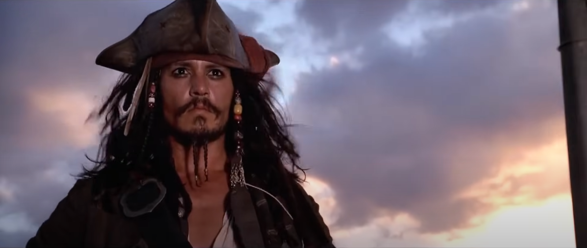
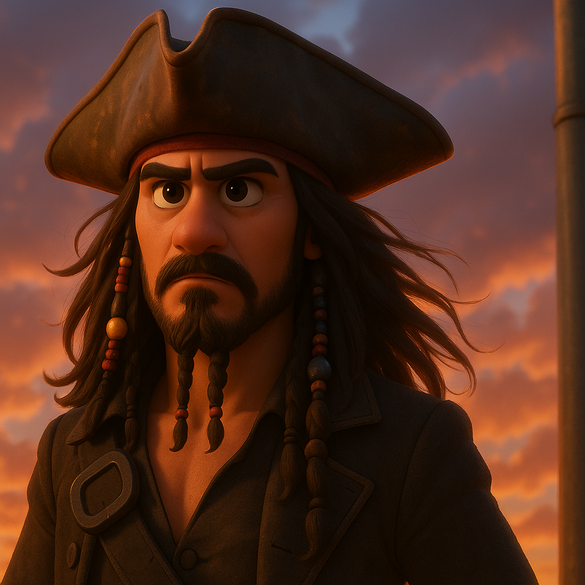

## 🎬 Pixar Görsel Karşılaştırmaları

<table>
  <tr>
    <td align="center"></td>
    <td align="center"></td>
  </tr>
  <tr>
    <td align="center"></td>
    <td align="center"></td>
  </tr>
</table>

---

## 🎥 Örnek Videolar

- [📹 Video 1](example_outputs/result1.mp4)  
- [📹 Video 2](example_outputs/result2.mp4)


---
# 🎨 Vid2ToonAI – Pixar Tarzı Video/Görsel Stilizasyon Sistemi

Vid2ToonAI, gerçek video veya görselleri kare kare işleyerek Pixar tarzı çizgi film estetiğine dönüştüren bir yapay zeka sistemidir.  
Proje, Stable Diffusion WebUI altyapısı ve özel modeller ile img2img dönüşümü uygulayarak kullanıcıya yüksek kalitede stilize içerikler sunar.

---

## 🚀 Proje İşlevselliği

🎬 **Video ve Görsel Dönüştürme**: Gerçek video ve görselleri karelere ayırarak Pixar tarzı animasyona dönüştürür.  
🧠 **Yapay Zeka Destekli Stilizasyon**: Stable Diffusion modelleri (ToonYou, DreamShaper, vootou) kullanılarak stil değişimi uygular.  
🎨 **Pixar Tarzı Görselleştirme**: 3D çizgi film estetiğine yakın sonuçlar üretir.  
📊 **Kalite Ölçümleme**: LPIPS ve SSIM metrikleri ile görsel kalite bilimsel olarak analiz edilir.  
📁 **Tam Yerel Sistem**: API’siz, tamamen yerel çalışır. İnternete ihtiyaç duymaz.

---

## 👨‍💻 Geliştirici

Bu proje **Burak AVCI** tarafından geliştirilmiştir.  
📧 burakavci0206@gmail.com

---

## 🛠️ Gereksinimler

Bu projeyi çalıştırmak için aşağıdaki yazılımlara ihtiyaç vardır:

- Python 3.10.11  
- NVIDIA GPU + CUDA desteği  
- Aşağıdaki Python kütüphaneleri:

```bash
pip install torch torchvision lpips opencv-python tqdm pandas scikit-image


---

##📈 Performans Metrikleri

### 📊 LPIPS Kalite Değerlendirme

| Görsel         | LPIPS Skoru |
|----------------|--------------|
| `input1.jpg`   | 0.4892       |
| `input2.jpg`   | 0.5880       |
| **Ortalama**   | **0.5386**   |

> Görsel kalitenin değerlendirilmesi için **LPIPS (Learned Perceptual Image Patch Similarity)** metriği kullanılmıştır.  
> Stilize edilen görsellerin orijinallerine algısal benzerliği 0–1 arası bir skala ile ölçülür.  
> Bu projede elde edilen ortalama LPIPS skoru **0.5386** olup, bu değer Pixar tarzı yüksek stilizasyon içeren dönüşümlerde kabul edilebilir düzeydedir.

### 📊 SSIM Kalite Değerlendirme (Yapısal Benzerlik)

| Görsel         | SSIM Skoru |
|----------------|-------------|
| `input1.jpg`   | 0.4399      |
| `input2.jpg`   | 0.3618      |
| **Ortalama**   | **0.4008**  |

> Görsel kaliteyi yapısal yönden değerlendirmek için **SSIM (Structural Similarity Index)** metriği kullanılmıştır.  
> Bu metrik, renk ve doku gibi detaylar yerine yapının, kenarların ve kontrastın korunma düzeyini ölçer.  
> 0.4008'lik ortalama skor, yoğun stilizasyon uygulanan bu projede yapısal bozulmanın kabul edilebilir düzeyde olduğunu göstermektedir.


